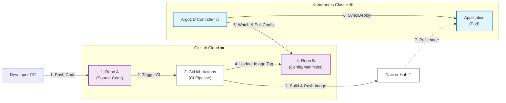

# Go-K8s-GitOps-Demo 🚀

>一個完整依照 Cloud Native **GitOps** 的實作專案。
展示如何將 Golang 應用程式透過 **GitHub Actions 進行 CI (持續整合)**
並使用 **ArgoCD 實踐 CD (持續部署) 到 Kubernetes 叢集**。

---
###### ✨ 特色 (Features)

* **全自動化 CI/CD**：從 Code Commit 到上線完全無需人工介入。
* **GitOps 最佳實踐**：採用「雙 Repo」策略（源程式碼與CD分離），確保 **Git 是唯一的真理 (Single Source of Truth)**。
* **多架構支援 (Multi-Arch)**：自動構建支援 `linux/amd64` 與 `linux/arm64` (Apple Silicon) 的 Docker Image。
* **自我修復 (Self-Healing)**：ArgoCD 自動監控並修正任何非預期的手動變更 (Configuration Drift)。
* **零停機更新**：利用 Kubernetes Rolling Update 實現平滑版更。

---
###### 🛠 專案結構 (Repositories) & 技術堆疊 (Tech Stack)
- 本專案分為兩個儲存庫：
1.  **Source Code Repo (本專案)**: 包含 Go 程式碼、Dockerfile 與 GitHub Actions Workflow。
2.  **CD Repo (Kubernetes Manifests)**: 包含 K8s YAML 設定檔 (`deployment.yml`, `service.yml`)。

| 類別 | 工具 | 用途 |
| :--- | :--- | :--- |
| **語言** | Golang (Gin Framework) | 後端應用程式 |
| **容器化** | Docker | 應用封裝 |
| **CI 工具** | GitHub Actions | 自動化構建、測試、推送 Image |
| **CD 工具** | ArgoCD | GitOps 同步與部署管理 |
| **基礎設施** | Kubernetes | 容器編排與管理 |
| **環境** | OrbStack | 本地 Kubernetes 模擬環境 |

---
###### 🚀 實作影片 (Experimental Video)

---
###### 🚀 架系統架構 (Architecture)

---
## 🚀 執行指南 (Getting Started)

為了確保環境設定正確，請嚴格依照以下順序閱讀並執行文件：
 [INSTALL.md](./INSTALL.md)。
https://deep-wedelia-d0a.notion.site/2ca488f98401801aa42ec3972c6d14ed