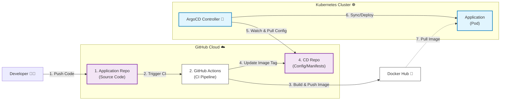

# Go-K8s-GitOps-Demo 🚀

>一個基於 Cloud Native `GitOps` 的實作專案。
展示如何將Application應用程式透過 **GitHub Actions 進行 CI (持續整合)**，
使用 **ArgoCD 實踐 CD (持續部署) 到 Kubernetes 叢集**，將部署控制權交由 ArgoCD 接管，展示**ArgoCD同步 Git中的預期狀態**。

---
###### 🚀 實作影片 (Experimental Video)
[-orange?style=for-the-badge&logo=youtube)](https://pub-05c62739ac6f4499a3401b26d0e9faaf.r2.dev/video/ArgoCD_video.mp4) 

---
###### 🚀 架系統架構 (Architecture)

---
###### ✨ 特色 (Features)

* **全自動化 CI/CD**：從 Code Commit 到上線完全無需人工介入。
* **GitOps 最佳實踐**：採用「雙 Repo」策略（源程式碼與CD分離），確保 **Git 是唯一的真理 (Single Source of Truth)**。
* **多架構支援 (Multi-Arch)**：自動構建支援 `linux/amd64` 與 `linux/arm64` (Apple Silicon) 的 Docker Image。
* **自我修復 (Self-Healing)**：ArgoCD 自動監控並修正任何非預期的手動變更 (Configuration Drift)。
* **零停機更新**：利用 Kubernetes Rolling Update 實現平滑版更。

---
###### 🛠 專案結構 (Repositories) & 技術堆疊 (Tech Stack)
- 本專案分為兩個儲存庫：
1.  **Source Code Repo (Application Repo本專案)**: 包含 Go 程式碼、Dockerfile 與 GitHub Actions Workflow。
2.  **CD Repo (Kubernetes Manifests)**: 包含 Kubernetes YAML 設定檔 (`deployment.yml`)。

| 類別 | 工具 | 用途 |
| :--- | :--- | :--- |
| **語言** | Golang (Gin Framework) | 後端應用程式 |
| **容器化環境** | Docker | 應用封裝 |
| **CI 工具** | GitHub Actions | 自動化構建、測試、推送 Image |
| **CD 工具** | ArgoCD | GitOps 同步與部署管理 |
| **基礎設施** | Kubernetes | 容器編排與管理 |
| **環境** | OrbStack | 本地 Kubernetes 模擬環境 |

---
###### 系統流程說明 (GitHub 雙Repo, DockerHub, ArgoCD, Kubernetes )
>先說明 *系統流程* ，細節於 Installation.md & 下方一併詳細說明 
Application Repo(CI) -> CD Repo -> ArgoCD -> DockerHub -> Kubernetes

 - ----- GitHub -----
    1. Application Repo 做 CI 動作，含有以下操作:
    2. 生成 Image, Tags(:lastest, :hash)  
    3. 把 Image, Tags(:lastest, :sha256) 推到 DockerHub上
     `(前提是有綁定DockerHub推送權限)` 
    4. *(觸發GitHub機器人)* 修改 CD Repo 對應的 `deployment.yml`內容 `Tags`
     `(前提是有綁定 deploy key 權限)` 
 - ----- Kubernetes 集群 -----

    5. ArgoCD 本身會一直監聽 CD Repo，`GitOps原則`且時刻同步管線於Git 
     `(前提是有先拉好管線，且開啟同步機制)` 
    6. *(當 ArgoCD 發現 Git 變動時)* 會去 **同步管線配置**
     `ArgoCD預設會看deployment.yml的變動，也可以彈性調整`
    7. 檢測 Kube 內是否有該Image
     `沒有的話: 會去 DockerHub 拉取部屬`
    > - 就算 **私自Kubectl 修改配置** 也沒用 
    ArgoCD會**自動 Rollback**，依照Git上的 deployment.yml 配置

---
## 🚀 執行指南 (Getting Started)

為了確保環境設定正確，請嚴格依照以下順序閱讀並執行文件：

**1. 先閱讀並執行環境安裝**： 

 

**2. 實作報告**： 

> 內容包含：透過 GitHub Actions 與 ArgoCD 實現 GitOps 自動化部署、使用 OrbStack (K8s) 並安裝 ArgoCD、區分 App Repo (原始碼) 與 Config Repo (部署清單)、GitHub Actions 完成 CI (打包鏡像) 後，利用 SSH Key 自動更新 Config Repo 的版本標籤、由 ArgoCD 偵測變更，將新版本自動部署至 K8s。