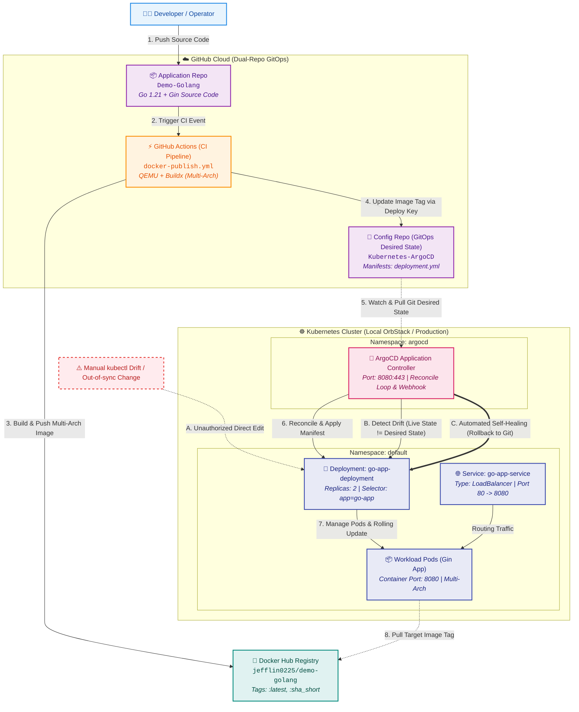

# ArgoCD GitOps Lab (Declarative Continuous Delivery)

> **基於 Cloud Native 標準的宣告式 GitOps 持續部署架構**。  
> 本專案實作雙儲存庫（Dual-Repository）隔離策略，串聯 **GitHub Actions (Push-based CI)** 進行多架構容器建置，並由部署於 Kubernetes 內的 **ArgoCD (Pull-based CD)** 主動監聽配置庫變更，以 Git 作為環境狀態的唯一真理（Single Source of Truth），達成零手動介入的全自動化發布與自我修復（Self-Healing）閉環。

---

## 實作演示 (Demo Video & GIF)

[](https://pub-05c62739ac6f4499a3401b26d0e9faaf.r2.dev/video/ArgoCD_video.mp4)


---

## 系統架構 (System Architecture)

本架構實踐 **Push-based CI** 與 **Pull-based CD** 的安全分界：CI 流程僅持有 Deploy Key 權限更新配置庫，不暴露任何 Kubernetes 叢集憑證；叢集內部 ArgoCD 負責狀態比對與同步，兼具高安全性與自動容錯治理。


```mermaid
flowchart TB
    %% 樣式定義
    classDef dev fill:#e8f4fd,stroke:#1e88e5,stroke-width:2px,color:#0d47a1;
    classDef git fill:#f3e5f5,stroke:#8e24aa,stroke-width:2px,color:#4a148c;
    classDef ci fill:#fff3e0,stroke:#fb8c00,stroke-width:2px,color:#e65100;
    classDef reg fill:#e0f2f1,stroke:#00897b,stroke-width:2px,color:#004d40;
    classDef argo fill:#fce4ec,stroke:#d81b60,stroke-width:2px,color:#880e4f;
    classDef k8s fill:#e8eaf6,stroke:#3949ab,stroke-width:2px,color:#1a237e;
    classDef drift fill:#ffebee,stroke:#e53935,stroke-width:2px,stroke-dasharray: 5 5,color:#b71c1c;

    Dev["👨‍💻 Developer / Operator"]:::dev

    subgraph GitHubCloud ["☁️ GitHub Cloud (Dual-Repo GitOps)"]
        direction TB
        AppRepo["📦 Application Repo<br/><code>Demo-Golang</code><br/><i>Go 1.21 + Gin Source Code</i>"]:::git
        CIWorkflow["⚡ GitHub Actions (CI Pipeline)<br/><code>docker-publish.yml</code><br/><i>QEMU + Buildx (Multi-Arch)</i>"]:::ci
        ConfigRepo["📜 Config Repo (GitOps Desired State)<br/><code>Kubernetes-ArgoCD</code><br/><i>Manifests: deployment.yml</i>"]:::git
    end

    DockerHub["🐳 Docker Hub Registry<br/><code>jefflin0225/demo-golang</code><br/><i>Tags: :latest, :sha_short</i>"]:::reg

    subgraph K8sCluster ["☸️ Kubernetes Cluster (Local OrbStack / Production)"]
        direction TB
        subgraph ArgoCDNS ["Namespace: argocd"]
            ArgoController["🐙 ArgoCD Application Controller<br/><i>Port: 8080:443 | Reconcile Loop & Webhook</i>"]:::argo
        end

        subgraph WorkloadNS ["Namespace: default"]
            K8sDeploy["🚀 Deployment: go-app-deployment<br/><i>Replicas: 2 | Selector: app=go-app</i>"]:::k8s
            K8sSvc["🌐 Service: go-app-service<br/><i>Type: LoadBalancer | Port 80 -> 8080</i>"]:::k8s
            AppPods["📦 Workload Pods (Gin App)<br/><i>Container Port: 8080 | Multi-Arch</i>"]:::k8s
        end
    end

    ManualIntervention["⚠️ Manual kubectl Drift / Out-of-sync Change"]:::drift

    %% 主鏈路：發布更新流 (步驟 1 ~ 8)
    Dev -->|"1. Push Source Code"| AppRepo
    AppRepo -->|"2. Trigger CI Event"| CIWorkflow
    CIWorkflow -->|"3. Build & Push Multi-Arch Image"| DockerHub
    CIWorkflow -->|"4. Update Image Tag via Deploy Key"| ConfigRepo
    ConfigRepo -.->|"5. Watch & Pull Git Desired State"| ArgoController
    ArgoController -->|"6. Reconcile & Apply Manifest"| K8sDeploy
    K8sDeploy -->|"7. Manage Pods & Rolling Update"| AppPods
    AppPods -.->|"8. Pull Target Image Tag"| DockerHub
    K8sSvc -->|"Routing Traffic"| AppPods

    %% 治理鏈路：配置漂移與自我修復 (步驟 A ~ C)
    ManualIntervention -.->|"A. Unauthorized Direct Edit"| K8sDeploy
    ArgoController -->|"B. Detect Drift (Live State != Desired State)"| K8sDeploy
    ArgoController ==>|"C. Automated Self-Healing (Rollback to Git)"| K8sDeploy
```

---

## 專案結構 (Directory Structure)

本儲存庫為 GitOps 體系中的 **Config Repo (部署描述庫)**，專門維護 Kubernetes 期望狀態清單與自動化指南：

```bash
Kubernetes-ArgoCD/
├── README.md               # 專案架構概覽、資料流模型與快速導引
├── Installation.md         # 雙 Repo 建置、Deploy Key 授權與 ArgoCD 部署手冊
├── Test_Report.md          # GitOps 完整驗證測試報告與資安效益總結
├── deployment.yml          # Kubernetes 核心清單 (Deployment 2 副本 + LoadBalancer Service)
└── ArgoCD_short.gif        # ArgoCD 狀態同步與自動化部署實機演示圖
```

> 相關源代碼儲存庫：[Demo-Golang](https://github.com/JeffLin0225/Demo-Golang)（包含 Go / Gin 核心業務代碼、Dockerfile 與 GitHub Actions CI Workflow）。

---

## 系統核心亮點 (Core Highlights)

1. **雙儲存庫 (Dual-Repo) 資安架構**：
   - **原始碼儲存庫 (App Repo)** 與 **環境設定儲存庫 (Config Repo)** 嚴格切分。
   - CI Pipeline 僅需持有一組具備有限寫入權限的 `ed25519` SSH Deploy Key 修改版本標籤，完全不對外暴露 Kubernetes Cluster Admin 憑證。
2. **單一真實來源 (Single Source of Truth)**：
   - Kubernetes 內所有運行中的資源狀態與副本數，皆嚴格對齊 Git 儲存庫上的 `deployment.yml`。
   - 所有發布行為均轉化為 Git 提交紀錄（Audit Log），回滾或追溯皆透明可驗證。
3. **主動修復與抗漂移 (Self-Healing & Drift Detection)**：
   - ArgoCD Controller 持續對比叢集實時狀態（Live State）與 Git 期望狀態（Desired State）。
   - 若叢集遭受非授權手動 `kubectl edit / delete` 篡改，ArgoCD 將立即判定為 `OutOfSync` 並自動觸發修復回滾。
4. **多架構容器建置 (Multi-Arch Buildx)**：
   - 整合 GitHub Actions QEMU 與 Docker Buildx，自動編譯並交付原生相容 `linux/amd64` 與 `linux/arm64`（Apple Silicon）的雙架構映像檔。
5. **平滑零停機發布 (Rolling Update)**：
   - Kubernetes Deployment 配置雙副本（`replicas: 2`），搭配 Readiness / Liveness 機制達成無縫滾動更新。

---

## 技術堆疊 (Tech Stack)

| 領域 | 核心技術 / 工具 | 職責說明 |
| :--- | :--- | :--- |
| **微服務後端** | Go 1.21+ / Gin Web Framework | 輕量高併發 HTTP API 應用程式服務 |
| **容器化封裝** | Docker / Docker Buildx / QEMU | 支援 Multi-Arch (`linux/amd64`, `linux/arm64`) 多平台封裝 |
| **持續整合 (CI)** | GitHub Actions | 自動化測試、容器映像編譯推送、SSH 自動化遞交 |
| **持續部署 (CD)** | ArgoCD (GitOps Engine) | 宣告式持續交付、期望狀態比對、自動同步與自我修復 |
| **容器編排** | Kubernetes (v1.28+) | 宣告式 Pod 調度、服務發現、Rolling Update 滾動更新 |
| **本機開發與測試** | OrbStack Kubernetes | 輕量級本機 Kubernetes 測試與驗證環境 |
| **安全憑證管理** | OpenSSH Deploy Keys / GitHub Secrets | 最小權限模型串接雙儲存庫與映像倉庫權限 |

---

## 系統資料流與流轉機制 (Data Flow Walkthrough)

### 1. 正常發布鏈路 (CI/CD Automated Lifecycle)
1. **程式碼變更**：開發者 Push 代碼或透過 `workflow_dispatch` 手動觸發 App Repo CI。
2. **多架構打包**：GitHub Actions 透過 Buildx 打包出 `linux/amd64` 與 `linux/arm64` 映像檔。
3. **映像庫推送**：映像檔推送至 Docker Hub，附帶 `:latest` 及當次提交標籤（如 `:${{ steps.vars.outputs.sha_short }}`）。
4. **跨庫版本遞交**：CI 透過 SSH Deploy Key 簽出 Config Repo，使用 `sed` 替換 `deployment.yml` 內的 `image: ...:<sha>` 並提交 Push。
5. **偵測與對比**：ArgoCD 週期輪詢（或 Webhook）感知 Git 變更，判定集群狀態為 `OutOfSync`。
6. **調諧部署**：ArgoCD 自動觸發 `Sync`，通知 Kubernetes Control Plane 執行 Rolling Update。
7. **流量切換**：K8s 下載最新映像檔啟動新 Pod，確認 Ready 後關閉舊 Pod，Service 對外提供無間斷服務。

### 2. 異常與配置漂移治理鏈路 (Governance & Self-Healing)
- **手動篡改**：若維運人員未透過 Git 流程，私自透過 `kubectl scale` 或 `kubectl edit` 修改 Pod 副本或配置。
- **漂移偵測**：ArgoCD Controller 背景巡檢即時識別 Live State 與 Git Desired State 不符。
- **自動回滾**：ArgoCD 自動執行覆蓋，將集群狀態強制重置回 Git 定義的期望狀態。

---

## 核心 Kubernetes 資源規格 (Manifest Specification)

本專案配置 `deployment.yml` 包含標準 Workload 與 Service 定義：

```yaml
apiVersion: apps/v1
kind: Deployment
metadata:
  name: go-app-deployment
spec:
  replicas: 2                       # 高可用雙副本配置
  selector:
    matchLabels:
      app: go-app
  template:
    metadata:
      labels:
        app: go-app
    spec:
      containers:
      - name: go-app
        image: jefflin0225/demo-golang:b6c28dc  # CI 自動寫入最新 Commit SHA
        ports:
        - containerPort: 8080       # 應用監聽端口
---
apiVersion: v1
kind: Service
metadata:
  name: go-app-service
spec:
  selector:
    app: go-app
  ports:
    - protocol: TCP
      port: 80                      # 外部訪問端口
      targetPort: 8080              # 容器內部轉送端口
  type: LoadBalancer                # 對外暴露服務 (支援雲端與 OrbStack 虛擬 IP)
```

---

## 常用維運與除錯指令 (Operations & Troubleshooting)

```bash
# 1. 檢查 ArgoCD 核心組件運作狀態
kubectl get pods -n argocd

# 2. 本地端口轉發訪問 ArgoCD Web UI (訪問 http://localhost:8080)
kubectl port-forward svc/argocd-server -n argocd 8080:443

# 3. 取得 ArgoCD admin 初始密碼
kubectl -n argocd get secret argocd-initial-admin-secret -o jsonpath="{.data.password}" | base64 -d; echo

# 4. 檢查業務 Pod 與 Service 狀態
kubectl get deployment,pods,svc -l app=go-app

# 5. 查看業務 Pod 即時日誌
kubectl logs -l app=go-app -f --tail=100

# 6. 使用 ArgoCD CLI 手動觸發狀態同步 (選用)
argocd app sync go-app
```

---

## 執行與驗證指南 (Getting Started)

完整環境搭建與實作細節，請參閱隨附手冊：

1. **環境安裝手冊**：參閱 [`Installation.md`](Installation.md)，涵蓋雙 Repo 建立、Deploy Key 授權設定、Docker Hub Token 與 ArgoCD 在 Kubernetes 內的部署步驟。
2. **實作驗證報告**：參閱 [`Test_Report.md`](Test_Report.md)，包含 CI/CD 執行記錄、版本遞交測試、期望狀態比對與資安成果總結。
